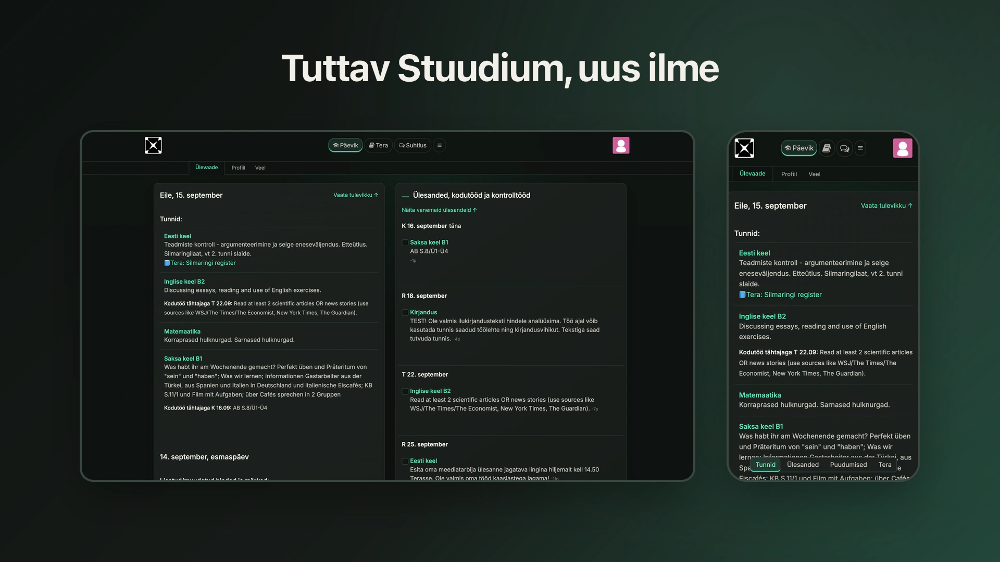
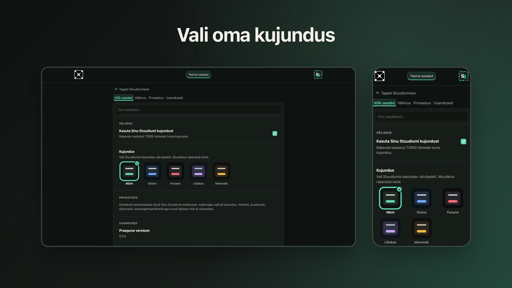

# Sinu Stuudium

  
  
<strong>TORGi õpilaselt TORGi õpilastele.</strong>

> [!WARNING]
> **Tähelepanu:** Sinu Stuudium on arendusfaasis olev prototüüp. Mõned funktsioonid võivad olla piiratud või ei pruugi veel töötada.

Kohanda TORG Stuudium enda moodi – läbimõeldud tume kujundus ja praktilised täiustused.

## Installimine

  

Brauserilaiendus Chrome-ile, Brave-ile ja muudele Chromium-põhistele brauseritele on varsti saadaval.

## Mis on Sinu Stuudium?

Sinu Stuudium täiendab päris TORG Stuudiumit, säilitades selle tuttava ülesehituse ja tööviisi. See lisab tumeda kujunduse, võimaluse välimust enda järgi kohandada ning praktilisi täiustusi nii arvutis kui ka Androidis.

Projekt sündis minu igapäevasest kogemusest TORGi õpilasena. Tahtsin, et tuttav Stuudium oleks isikupärasem, pimedas silmadele rahulikum ja mugavam kasutada. Projekt areneb päris kasutuses märgatud valukohtade ja vajaduste põhjal. Praegu keskendub Sinu Stuudium TORGi õpilastele ja Stuudiumi õpilasevaatele.

## Ekraanipildid

  <picture>
    <source media="(max-width: 600px)" srcset="assets/readme/screenshots/cross-device-home-narrow.webp">
    
  </picture>

  <picture>
    <source media="(max-width: 600px)" srcset="assets/readme/screenshots/cross-device-settings-narrow.webp">
    
  </picture>

- [Vaata rohkem ekraanipilte →](SCREEN_SHOT.md)

## Omadused

- Läbimõeldud tume kujundus
- Erinevad kujundused
- Seaded Stuudiumis
- Eraldiseisev Androidi rakendus

## Saadavus

| Platvorm             | Saadavus        | Kontrollitud keskkond |
| -------------------- | --------------- | --------------------- |
| Android              | Saadaval        | Android 16            |
| Chrome ja Brave      | Varsti saadaval | Chrome ja Brave       |
| Firefox, Safari, iOS | Pole toetatud   | —                     |

## Privaatsus ja sõltumatus

Sinu kooliandmeid ei koguta ega saadeta arendajale. Sinu Stuudium salvestab ainult toimimiseks vajalikud seaded sinu seadmesse. Sisselogimist ja kooliandmeid töötleb päris Stuudium.

Sinu Stuudium on sõltumatu ja mitteametlik projekt TORG Stuudiumile. See ei ole Stuudiumi ega TORGi ametlik toode.

Täpsem selgitus on [privaatsuspoliitikas](docs/PRIVACY.md).

## Tagasiside ja panustamine

Probleemidest ja ettepanekutest saab teada anda [GitHub Issuesi kaudu](https://github.com/rixerpixer007/TORG-stuudium-theme/issues).

  
Arendajale

- [Brauserilaienduse arendamine](docs/EXTENSION_DEVELOPMENT.md)
- [Androidi rakenduse ehitamine ja testimine](docs/MOBILE_DEVELOPMENT.md)
- [Projekti npm-käsud](docs/NPM_COMMANDS.md)

## Litsents

Sinu Stuudium on avaldatud [MIT-litsentsi](LICENSE) alusel.
